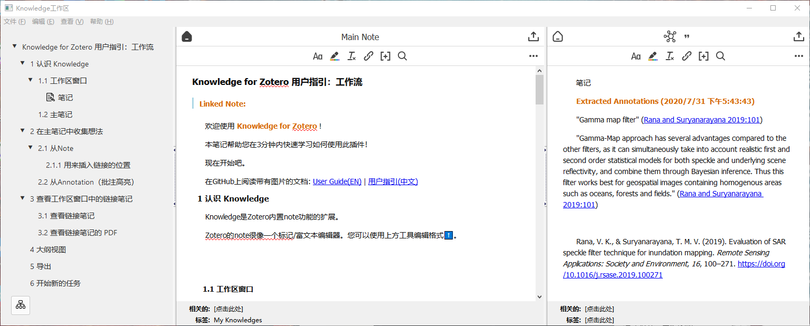
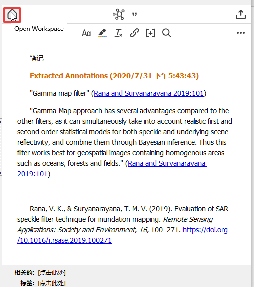

# Zotero Better Notes User Guide: Workflow

Welcome to **Zotero Better Notes** !

This note helps you quickly learn how to use this addon in 3 min!

Let's start now.

## 1 What is Knowledge

Knowledge is an extension of Zotero's built-in note function.

Zotero's note is much like a markdown/rich-text editor. You can edit the format with the tools above⬆️.

### 1.1 Workspace Window

The knowledge workspace window contains an outline area(left side⬅️), the main note area, and the preview area(right side➡️).

Open workspace by clicking the 'Open Workspace' line above the 'My Library' line in Zotero main window.

Alternatively, open it with the '🏠home' button on the top-left of note editors.

### 1.2 Main note

This addon uses a Zotero note item as the main note. It will show up on the main area of the workspace window.

All links will be added to the main note.

Set a note as the main note in the right-click popup menu.

### 1.3 Workspace Menu

**File menu**:

- Create new main note(Ctrl/Cmd+N)
- Open main note(Ctrl/Cmd+O)
- Import notes(Ctrl/Cmd+I)
- Export notes(Ctrl/Cmd+E)
- Close workspace window(Ctrl/Cmd+W)

**Edit menu**:

- Insert heading
- Decrease selected heading level(Tab)
- Increase selected heading level(Shift+Tab)

**View menu**:

- Outline Views

**Help menu**:

- Open user guide

## 2 Gather Ideas to Main Note

### 2.1 From Note

Select a note outside the workspace window(in Zotero items view or PDF viewer), you may realize a button with the addon's icon on the top of the note editor toolbar.

Click it, the current note link will be inserted into the main note's cursor position;

Select a heading, and the note's link will be inserted into the end of this heading.

> **💡 Try it now!**
>
> Open a PDF and open/create a note(in the right side bar of PDF viewer). Add a link below.

### 2.2 From Annotation (including highlight and picture)

You can find a button with the addon's icon on every annotation(in the left sidebar of PDF viewer).

Click it, and a new note containing this annotation will be created under the PDF item. Annotation tags are copied to the new note.  
You can then add its link to the main note in the note editor.

> **💡 Try it now!**
>
> Open a PDF and open/create an annotation(in the left sidebar of PDF viewer).

### 2.3 Import Existing Notes

You can import notes into the main note.

- In workspace window, File -> Import Notes;
- Select notes and confirm.

Notes' links will be appended to the end of the main note.

## 3 Check Linked Notes in Workspace Window

### 3.1 View Linked Notes

Suppose you have added a lot of links to the main note. Now, it's time to view what you've got.

Go back to the workspace window.

Open a note link, the linked note will show up in the preview area(right side➡️).

> **💡 Try it now!**
>
> Open a note link.

### 3.2 View Linked Note's PDF

Click the '📄PDF' button on the top-left of the preview area.

> **💡 Try it now!**
>
> Open a linked note's PDF.

### 3.3 Insert Citation

Click the "Insert Citation" button in the middle of the preview area.

Currently, the quick copy format must be a citation format, otherwise, this function will not work. See Edit->Preferences->Export in Zotero main window.

### 3.4 Import Linked Note

Import the selected linked note's context to the main note by clicking the 'import note' button in the link popup.

Example:

> **💡 Try it now!**
>
> Import one linked note.

### 3.5 Update Note Link Text

Update the link text in main note by clicking the 'update link text' button  in the link popup.

> **💡 Try it now!**
>
> Modify the first line of a linked note in the preview area. Then update its link text in the main note.

## 4 Outline Mode

Switch the outline mode with the '📊mode' button on the bottom of the outline area.

> **💡 Try it now!**
>
> Try different outline modes.

## 5 Export

Click the '⬆️export' button on the top-right of the main note area. Choose a format to export, i.e. MarkDown.

If you are using MS Word/OneNote, export to clipboard and paste there.

> **💡 Try it now!**
>
> Export this main note!

## 6 Start a New Job

After the export, you may want to start a new job with a new empty main note.

Create a note and right-click to set it as the main note, or just create a new main note.

Open different main note in workspace window->File->Open Main Note.

> **✨ Hint**
>
> Create a new collection and save all main notes there is the best way to manage them.
>
> The user guide should have done this for you.

Congratulations!

You can select a new main note and start working with **Zotero Better Notes** now. Have fun!
