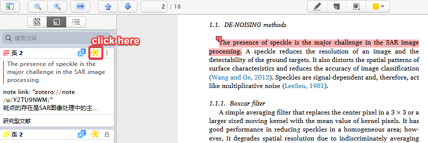
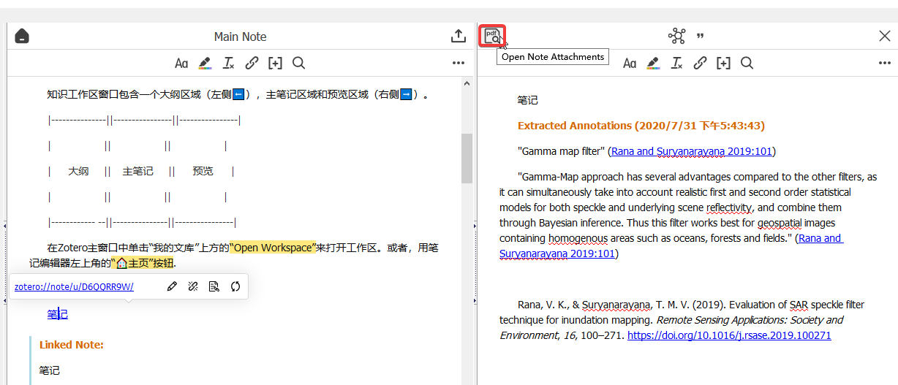
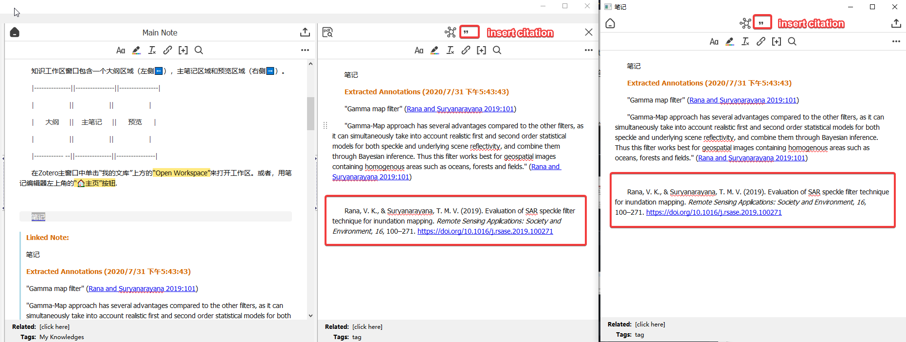
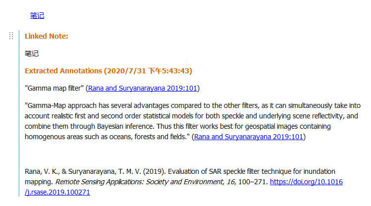
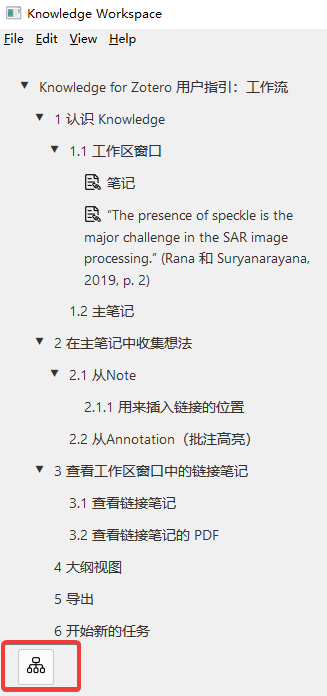
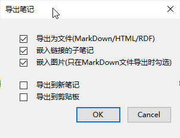

# Zotero Better Notes 用户指引：工作流

欢迎使用 **Zotero Better Notes** !

本笔记帮助您在 3 分钟内快速学习如何使用此插件！

现在开始吧。

## 1 认识 Knowledge

Knowledge 是 Zotero 内置 note 功能的扩展。

Zotero 的 note 很像一个标记/富文本编辑器。您可以使用上方工具编辑格式 ⬆️。

### 1.1 工作区窗口

知识工作区窗口包含一个大纲区域（左侧 ⬅️），主笔记区域和预览区域（右侧 ➡️）。

在 Zotero 主窗口中单击“我的文库”上方的“Open Workspace”来打开工作区。

或者，用笔记编辑器左上角的“🏠 主页”按钮。

### 1.2 主笔记

这个插件使用某一个 Zotero note 作为主笔记。它将显示在工作区窗口的主笔记区域。

所有链接都将添加到主笔记中。

从右键菜单中设置当前一个笔记为主笔记：

### 1.3 工作区菜单栏

**文件菜单**：

- 创建新的主笔记(Ctrl/Cmd+N)
- 打开主笔记(Ctrl/Cmd+O)
- 导入笔记(Ctrl/Cmd+I)
- 导出笔记(Ctrl/Cmd+E)
- 关闭(Ctrl/Cmd+W)

**编辑菜单**：

- 插入标题
- 降低标题层级
- 提升标题层级

**查看菜单**：

- 大纲视图

**帮助菜单**：

- 打开用户指引

## 2 在主笔记中收集想法

### 2.1 从 Note

在工作区窗口外选择一个 note（在 Zotero 条目视图或 PDF 阅读器中），您会在笔记编辑器工具栏顶部看到一个带有本插件图标的按钮。

点击它，当前笔记的链接将插入主笔记的光标位置；

选择一个标题层级，笔记的链接将插入该标题的末尾。

> **💡 尝试一下!**
>
> 打开 PDF 并打开/创建笔记（在 PDF 阅读器的右侧栏中）。用上面的方法在这条主笔记添加一个链接。

### 2.2 从 Annotation（高亮批注和图片）

你可以在每个批注上找到一个带有插件图标的按钮（在 PDF 阅读器的左侧栏中）。

单击它，PDF条目下将创建一个带有此批注的新笔记。批注的标签将会复制到新的笔记。

然后可以在打开的笔记编辑器中将该笔记链接添加到主笔记。

> **💡 尝试一下!**
>
> 打开 PDF 并打开/创建批注高亮（在 PDF 阅读器的左侧栏中）。用上面的方法在这条主笔记添加一个链接。

### 2.3 从功能区导入笔记

支持从现有的多个笔记批量导入到主笔记中。

- 在工作区窗口菜单栏文件->导入笔记；
- 选择多个笔记并确认。

## 3 查看工作区窗口中的链接笔记

### 3.1 查看链接笔记

假设你已经在主笔记添加了很多的链接。现在，是时候看看你的结果了。

返回工作区窗口。

打开笔记链接，链接的笔记将显示在预览区域（右侧 ➡️）。

> **💡 尝试一下!**
>
> 在工作区窗口打开一个笔记链接。

### 3.2 查看链接笔记的 PDF

在上一步打开的预览笔记中，点击预览区左上角的“📄PDF”按钮。

> **💡 尝试一下!**
>
> 打开一个链接笔记的 PDF。

### 3.3 插入当前子笔记父条目文献的引用格式

在上一步打开的预览笔记中，点击预览区中间的“插入引用”按钮。

目前，快速复制格式需要设置为citation format，否则该功能无法正常工作。可在Zotero主窗口的编辑->首选项->导出中设置。

### 3.4 插入链接的子笔记

点击链接弹窗中的'import note'来插入选择的笔记内容。

插入之后：

> **💡 尝试一下!**
>
> 插入一个链接的笔记

### 3.5 更新链接文本

点击链接弹窗中的'update link text'来更新选择的笔记链接文本。

> **💡 尝试一下!**
>
> 在预览区域中编辑某个链接笔记的第一行文本，然后在主笔记区域更新它的链接文本。

## 4 大纲视图

点击大纲区域左下角的 ‘📊 大纲模式‘ 按钮 来切换大纲视图模式。

> **💡 尝试一下!**
>
> 尝试不同的大纲模式（思维导图）

## 5 导出

点击主笔记区域右上角的“⬆️ 导出”按钮，或者工作区窗口菜单的文件->导出主笔记。选择要导出的格式，比如 MarkDown。

如果您使用的是 MS Word/OneNote，请导出到剪贴板并粘贴到那里。

> **💡 尝试一下!**
>
> 导出这个主笔记！

## 6 开始新的任务

导出后，您可能希望使用新的空主笔记开始新任务。

创建一个笔记，然后在右键菜单中将其设置为主笔记；或者直接创建一个新的主笔记。

使用工作区窗口菜单的文件->打开主笔记以切换不同的主笔记。

> **✨ 提示**
>
> 创建一个新的文件夹并在其中专门保存所有的主笔记——这是管理主笔记的最佳方法。
>
> 用户指引应该已经为您做到了这一点。

恭喜!

你现在可以选择或新建一个主笔记，然后开始使用 **Zotero Better Notes**了。用的开心！
